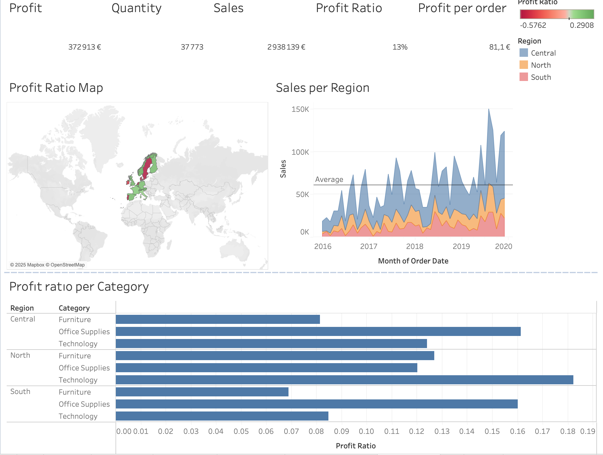
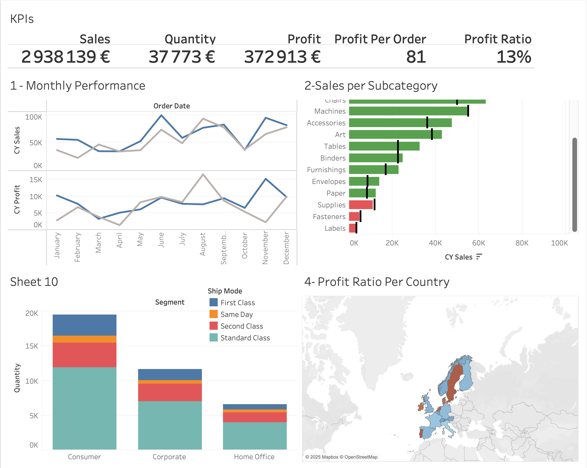

# 📊 Tableau Dashboard – Sales & Profit Performance Analysis

This interactive dashboard was created in Tableau to analyze sales, quantity, and profit performance across various dimensions such as time, region, shipping mode, and product categories.

## 🖼️ Dashboard Preview

  

## 📈 What's Inside?
- **KPI Panel**: Overall performance metrics including sales, profit, profit ratio, and quantity
- **Time Analysis**: Monthly and yearly trends of sales and profit
- **Subcategory Breakdown**: Top and bottom performing product types
- **Regional Performance**: Profit ratio and sales across European countries
- **Segment Insights**: Consumer, Corporate, Home Office shipping behavior
- **Profit by Category**: Profitability across Furniture, Office Supplies, and Technology

## 💡 Key Takeaways
- Sales are highest in the **Central region**, while profit ratio varies significantly across subcategories.
- **Technology** is highly profitable, especially in North and South regions.
- **Same-day shipping** tends to lower profitability despite high quantity.

## 📦 Tools Used
- Tableau
- Mapbox (for geographic visuals)

## 👩‍💻 Author
Saadet Doga Hascelik – Digital Marketing & Data Science Student @ Emlyon Business School

---
